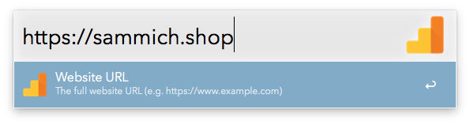
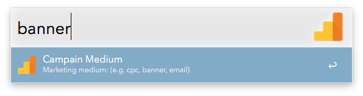
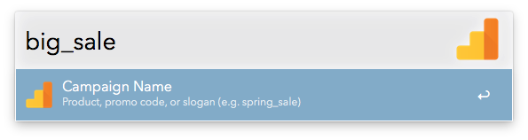
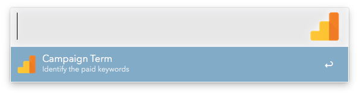
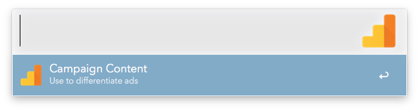
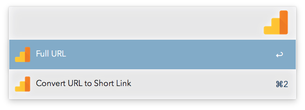
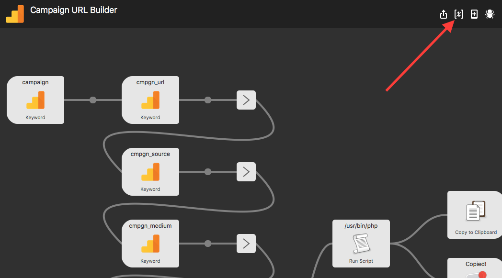
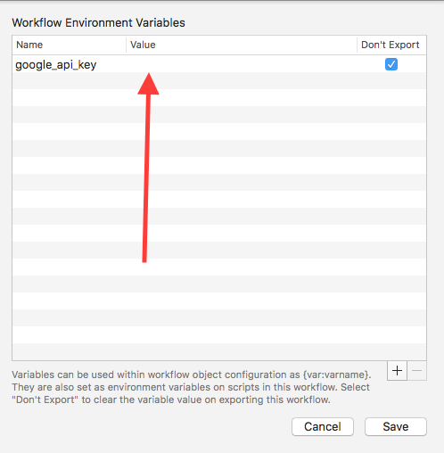

# Use Alfred to Build Campaign URLs
If you use [Alfred](https://www.alfredapp.com/) and track campaigns via [Google Analytics](https://analytics.google.com/), this tool is for you. This basically replicates the [Campaign URL Builder](https://ga-dev-tools.appspot.com/campaign-url-builder/) that Google provides in Alfred.

## Usage
1. [Download the workflow](https://github.com/sammichshop/alfred-campaign-url-builder/raw/master/Campaign%20URL%20Builder.alfredworkflow)
2. Double click to install
3. Type `campaign` to trigger
4. The workflow will guide you step-by-step through the parameters
5. Once it's finished, it will automatically copy the resulting URL to your clipboard
6. With the exception of the website URL, all other parameters are optional, just press enter to continue

### URL Shortener

Optional: If you'd like to use the [URL Shortener](https://developers.google.com/url-shortener/) in the workflow, you need to set your `google_api_key` in the workflow environment variables. [Here are instructions on generating your API key with Google](https://developers.google.com/url-shortener/v1/getting_started#APIKey).

